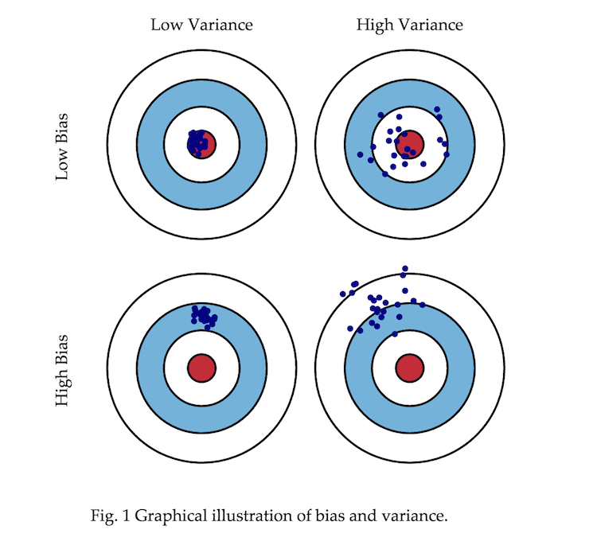

#  Statistics Review
DS | Lesson 4

### LEARNING OBJECTIVES
*After this lesson, you will be able to:*

- Explain the difference between causation vs. correlation
- Test a hypothesis within a sample case study
- Validate your findings using statistical analysis (p-values, confidence intervals)

### STUDENT PRE-WORK
*Before this lesson, you should already be able to:*

- Explain the difference between variance and bias  
- Use descriptive stats to understand your data

### LESSON GUIDE

| TIMING  | TYPE  | TOPIC  |
|:-:|---|---|
| 5 min  | [Opening](#opening)  | Lesson Objectives  |
| 5 min  | [Introduction](#introduction1)   | Causation and Correlation |
| 25 min  | [Lecture](#lecture1)  | Causality vs Correlation |
| 15 min  | [Guided Practice](#guided-practice)  | Confounding and DAGs |
| 5 min  | [Introduction](#introduction2)   | Hypothesis Testing |
| 30 min  | [Demo](#demo)   | Hypothesis Testing: Case Study |
| 5 min  | [Introduction](#introduction3) | Validate your findings |
| 20 min  | [Demo](#demo2)  | P-values, CI: Case Study|
| 35 min  | [Independent Practice](#independent-practice)  | Practice with p-values and CI|
| 15 min  | [Wrap-up](#wrapup)  | Review Guided Practice|

---

## Opening (5 min)
- Review any questions from last session
- Discuss Current Lesson Objectives
- Review prior exit tickets

## Intro: Hypothesis Testing (5 mins)

You'll remember from last time that we worked on descriptive statistics. How would we tell if there is a difference between our groups? How would we know if this difference was real or if our finding is simply due to chance?

These are the questions we often tackle when we are building out our models in the Refine & Build steps of our data science workflow.

For example, if we are working on sales data, how would we know if there was a difference between the buying patterns of men and women at Acme Inc? Hypothesis testing!

#### Hypothesis testing steps
Generally speaking, you start with a null hypothesis and an alternative hypothesis, which is opposite the null. Then, you check whether the data supports rejecting your null hypothesis or failing to reject the null hypothesis.

Note that "failing to reject" the null is ***not*** the same as "accepting" the null hypothesis. Your alternative hypothesis may indeed be true, but you don't necessarily have enough data to show that yet.

This distinction is important to help you avoid overstating your findings. You should only state what your data and analysis can truly represent.

Here is an example of a conventional hypothesis test:

- Null hypothesis: There is no relationship between Gender and Sales.
- Alternative hypothesis: There is a relationship between gender and Sales

Let's dive into this more with the demo.

## Demo: Hypothesis Testing Case Study (30 mins)
> Instructor Note: Walk through the demo with students. Throughout the demo there are certain sections marked student questions. Give  students time to answer these questions individually or as a small group (2 min or so per question), then share with the class and discuss before moving on to the next question.

> Instructor Note: Have students open the [guided demo starter code](./code/starter-code/demo-starter-code-4.ipynb) and move through Part 1. Answers can be found in the [demo solution code](./code/solution-code/demo-solution-code-4.ipynb).

**Check:** What is the null hypothesis? Why is this important to use?

#### Bias vs Variance
- **Error due to Bias:** Error due to bias is taken as the *difference between the expected (or average) prediction of our model and the correct value which we are trying to predict.* Imagine you could repeat the whole model building process more than once: each time you gather new data and run a new analysis, thereby creating a new model. Due to randomness in the underlying data sets, the resulting models will have a range of predictions. Bias measures **how far off in general these models' predictions are from the correct value.**  

- **Error due to Variance:** The error due to variance is taken as *the variability of a model prediction for a given data point.* Again, imagine you can repeat the entire model building process multiple times. The variance is **how much the predictions for a given point vary between different realizations of the model.**

## Intro: Validate your findings (5 mins)
How do we tell if the association we observed is *statistically significant*?

*Statistical Significance* is the likelihood that a result or relationship is caused by something other than mere random chance. Statistical hypothesis testing is traditionally employed to determine if a result is statistically significant or not.

Typically, we use a cut point of 5%. In other words, we say that something is NOT statistically significant if there is a less than 5% chance that our finding was due to chance alone.

When data scientists present results and say we found a significant result- it is almost always using these criteria. Let's dive into them further to understand p-values and confidence intervals.

## Demo: P-values & CI in the case study (20 mins)

> Instructor Note: Have students open the [guided demo starter code](./code/starter-code/demo-starter-code-4.ipynb) and move through Part 2. Answers can be found in the [demo solution code](./code/solution-code/demo-solution-code-4.ipynb).

**Check:** What does a 95% confidence interval indicate?

> Answer: If we repeated our analysis 100 times, the point estimate we found would be there 95% of the time.

## Independent Practice (35 min)
For this exercise, you will look through a variety of analyses and interpret the findings.

You will be presented a series of outputs (similar to the ones we will generate once we start regression) and tables from a published analysis.

For this lab you will be asked to read these outputs and tables and determine if the findings are statically significant or not.

You will also get practice looking at the output and understanding how the model was built (e.g. identifying predictor/exposure vs outcome).

> Instructor Note: Have students open and work through the [lab starter code](./code/starter-code/lab-starter-code-4.ipynb).

## Conclusion: Questions (15 mins)

Any questions?

***

### BEFORE NEXT CLASS
|   |   |
|---|---|
| **UPCOMING PROJECTS**  | [Unit Project 2](../../projects/unit-projects/project-2/readme.md)  |

### ADDITIONAL RESOURCES
- If any
